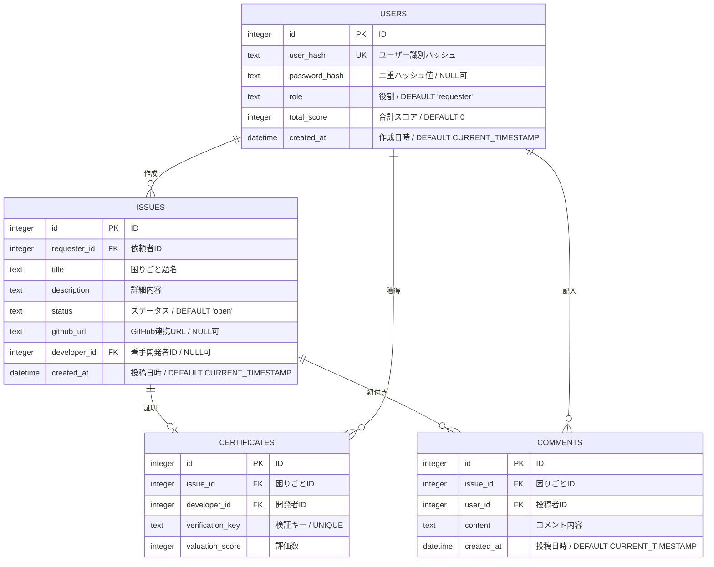
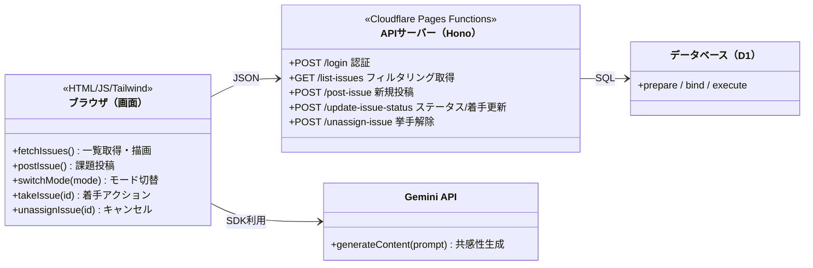

# 困りごとラボ プロジェクト全容（正典）

このドキュメントは「困りごとラボ」プロジェクトのアーキテクチャ、機能、データ構造、およびAPI仕様を網羅した公式サマリーです。

## 1. アーキテクチャ概要

本プロジェクトは Cloudflare のエコシステムをフル活用した、モダンなサーバーレスWebアプリケーションです。

- **Frontend**: HTML5 / Vanilla JS / Tailwind CSS (CDN)
  - Cloudflare Pages にホストされ、高速な配信を実現。
- **Backend**: Hono (Web standard framework)
  - Cloudflare Pages Functions 上で動作。超軽量かつ高速なルーティングを提供。
- **Database**: Cloudflare D1 (SQLite-based)
  - フルマネージドなサーバーレスリレーショナルデータベース。
- **AI Integration**: Gemini API (gemini-2.5-flash)
  - 投稿に対する共感コメント生成などに活用。

---

## 2. 実装済み機能

### 🔐 認証システム（二重ハッシュ化プロトコル）
本プロジェクトでは、セキュリティ向上のためクライアントとサーバーの両方でハッシュ化を行うプロトコルを採用しています。

1.  **Client-Side Hashing**: 
    - ブラウザ上で入力された生パスワードを `SHA-256` で1回ハッシュ化します。
    - これにより、通信経路（HTTPS下でも）に生パスワードが流れるのを防ぎます。
2.  **Server-Side Hashing**:
    - 受信したハッシュ値を、Hono側でさらに `SHA-256` でハッシュ化します。
    - データベースにはこの「二重ハッシュ化」された値が `password_hash` として保存されます。
    - 万が一データベースが流出しても、生パスワードの復元を極めて困難にします。
- **セッション管理**: `localStorage` を使用した簡易保持（`user_hash` 等）。
- **ログインガード**: 未ログインユーザーを `login.html` へ自動リダイレクト。

### 🏠 相談者モード（デフォルト）
- **マイ・ダッシュボード**: 自分の投稿をステータスごとに3カラム（受付中 / 進行中 / 解決済み）で整理して表示。
- **困りごと投稿**: AIコメント機能を備えた新規課題投稿インターフェース。
- **詳細閲覧**: 各課題のタイトルをクリックして詳細内容を確認可能。

### 🛠️ 開発者モード
- **ワークスペース分離**: 
  - 上部：「あなたが現在着手中の課題」エリア
  - 下部：「解決を待っている課題一覧」エリア
- **着手（挙手）機能**: 未着手の課題に対し、ワンクリックで自分が担当者として着手。
- **挙手を下ろす（キャンセル）機能**: 担当した課題をキャンセルし、再び「未着手」に戻すことが可能。

---

## 3. データベース設計 (ER図)

---

## 4. クラス図 / システム構成図

---

## 5. API エンドポイント仕様（主要）

| メソッド | パス | 説明 | 主なパラメータ |
| :--- | :--- | :--- | :--- |
| `POST` | `/api/login` | ログイン / 新規登録 | `user_hash`, `password` |
| `GET` | `/api/list-issues` | 課題一覧取得（全件 / 自分） | `filter`, `user_hash` |
| `POST` | `/api/post-issue` | 新しい困りごとの投稿 | `title`, `description`, `user_hash` |
| `POST` | `/api/update-issue-status` | 着手（挙手）またはステータス変更 | `id`, `status`, `user_hash` |
| `POST` | `/api/unassign-issue` | 着手のキャンセル（挙手を下ろす） | `id` |

---

## 6. 今後の課題 / 未実装機能
- [ ] 解決証明 (`certificates`) の発行・承認フローの実装
- [ ] コメント (`comments`) の投稿・表示機能の実装
- [ ] 管理者向けダッシュボード（全ユーザー・全課題の管理）
- [ ] パスワード再設定・ニックネーム変更などのプロフィール管理
