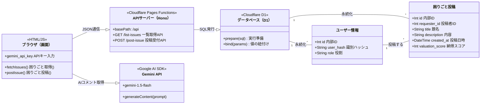

```mermaid
classDiagram
    direction LR
    
    class Browser_Frontend ["ブラウザ（画面）"] {
        <<HTML/JS>>
        +gemini_api_key APIキー入力
        +fetchIssues() 困りごと取得()
        +postIssue() 困りごと投稿()
    }

    class Hono_API_Handler ["APIサーバー（Hono）"] {
        <<Cloudflare Pages Functions>>
        +basePath: /api
        +GET /list-issues 一覧取得API
        +POST /post-issue 投稿受付API
    }

    class Gemini_API ["Gemini API"] {
        <<Google AI SDK>>
        +gemini-1.5-flash
        +generateContent(prompt)
    }

    class D1_Database ["データベース（D1）"] {
        <<Cloudflare D1>>
        +prepare(sql) 実行準備
        +bind(params) 値の紐付け
    }

    class User ["ユーザー情報"] {
        +Int id 内部ID
        +String user_hash 識別ハッシュ
        +String role 役割
    }

    class Issue ["困りごと投稿"] {
        +Int id 内部ID
        +Int requester_id 投稿者ID
        +String title 題名
        +String description 内容
        +DateTime created_at 投稿日時
        +Int valuation_score 納得スコア
    }

    Browser_Frontend --|> Hono_API_Handler : JSON通信
    Browser_Frontend --|> Gemini_API : AIコメント取得
    Hono_API_Handler --|> D1_Database : SQL発行
    D1_Database "1" -- "*" User : 永続化
    D1_Database "1" -- "*" Issue : 永続化
    User "1" -- "*" Issue : 投稿する
```
