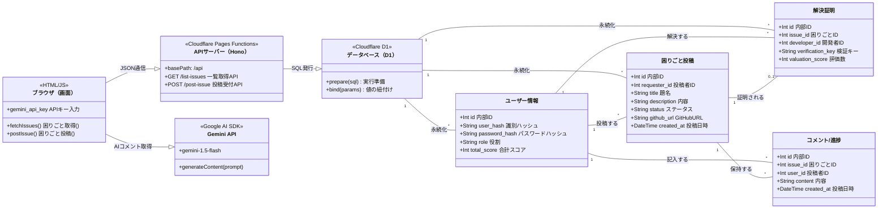

```mermaid
classDiagram
    direction LR
    
    class Browser_Frontend ["ブラウザ（画面）"] {
        <<HTML/JS>>
        +gemini_api_key APIキー入力
        +fetchIssues() 困りごと取得()
        +postIssue() 困りごと投稿()
    }

    class Hono_API_Handler ["APIサーバー（Hono）"] {
        <<Cloudflare Pages Functions>>
        +basePath: /api
        +GET /list-issues 一覧取得API
        +POST /post-issue 投稿受付API
    }

    class Gemini_API ["Gemini API"] {
        <<Google AI SDK>>
        +gemini-1.5-flash
        +generateContent(prompt)
    }

    class D1_Database ["データベース（D1）"] {
        <<Cloudflare D1>>
        +prepare(sql) 実行準備
        +bind(params) 値の紐付け
    }

    class User ["ユーザー情報"] {
        +Int id 内部ID
        +String user_hash 識別ハッシュ
        +String password_hash パスワードハッシュ
        +String role 役割
        +Int total_score 合計スコア
    }

    class Issue ["困りごと投稿"] {
        +Int id 内部ID
        +Int requester_id 投稿者ID
        +String title 題名
        +String description 内容
        +String status ステータス
        +String github_url GitHubURL
        +DateTime created_at 投稿日時
    }

    class Certificate ["解決証明"] {
        +Int id 内部ID
        +Int issue_id 困りごとID
        +Int developer_id 開発者ID
        +String verification_key 検証キー
        +Int valuation_score 評価数
    }

    class Comment ["コメント/進捗"] {
        +Int id 内部ID
        +Int issue_id 困りごとID
        +Int user_id 投稿者ID
        +String content 内容
        +DateTime created_at 投稿日時
    }

    Browser_Frontend --|> Hono_API_Handler : JSON通信
    Browser_Frontend --|> Gemini_API : AIコメント取得
    Hono_API_Handler --|> D1_Database : SQL発行
    D1_Database "1" -- "*" User : 永続化
    D1_Database "1" -- "*" Issue : 永続化
    D1_Database "1" -- "*" Certificate : 永続化
    User "1" -- "*" Issue : 投稿する
    User "1" -- "*" Certificate : 解決する
    Issue "1" -- "0..1" Certificate : 証明される
    User "1" -- "*" Comment : 記入する
    Issue "1" -- "*" Comment : 保持する
```
