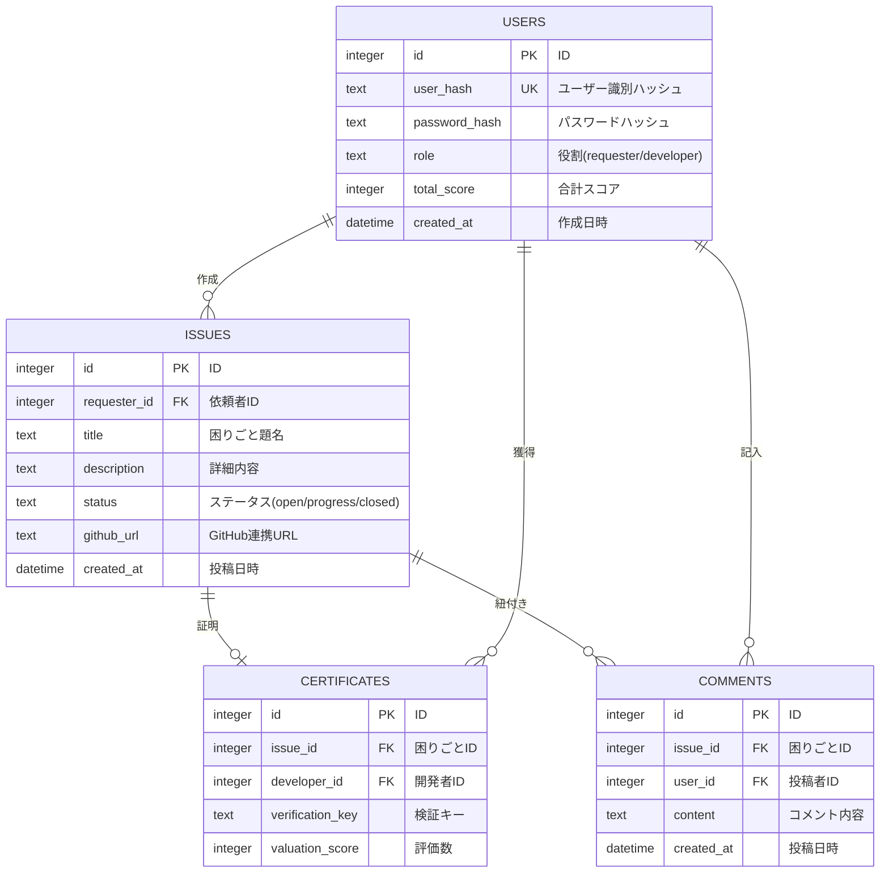

```mermaid
erDiagram
    USERS {
        integer id PK "ID"
        text user_hash UK "ユーザー識別ハッシュ"
        text password_hash "パスワードハッシュ"
        text role "役割(requester/developer)"
        integer total_score "合計スコア"
        datetime created_at "作成日時"
    }

    ISSUES {
        integer id PK "ID"
        integer requester_id FK "依頼者ID"
        text title "困りごと題名"
        text description "詳細内容"
        text status "ステータス(open/progress/closed)"
        text github_url "GitHub連携URL"
        datetime created_at "投稿日時"
    }

    CERTIFICATES {
        integer id PK "ID"
        integer issue_id FK "困りごとID"
        integer developer_id FK "開発者ID"
        text verification_key "検証キー"
        integer valuation_score "評価数"
    }

    COMMENTS {
        integer id PK "ID"
        integer issue_id FK "困りごとID"
        integer user_id FK "投稿者ID"
        text content "コメント内容"
        datetime created_at "投稿日時"
    }

    USERS ||--o{ ISSUES : "作成"
    ISSUES ||--o| CERTIFICATES : "証明"
    USERS ||--o{ CERTIFICATES : "獲得"
    ISSUES ||--o{ COMMENTS : "紐付き"
    USERS ||--o{ COMMENTS : "記入"
```
