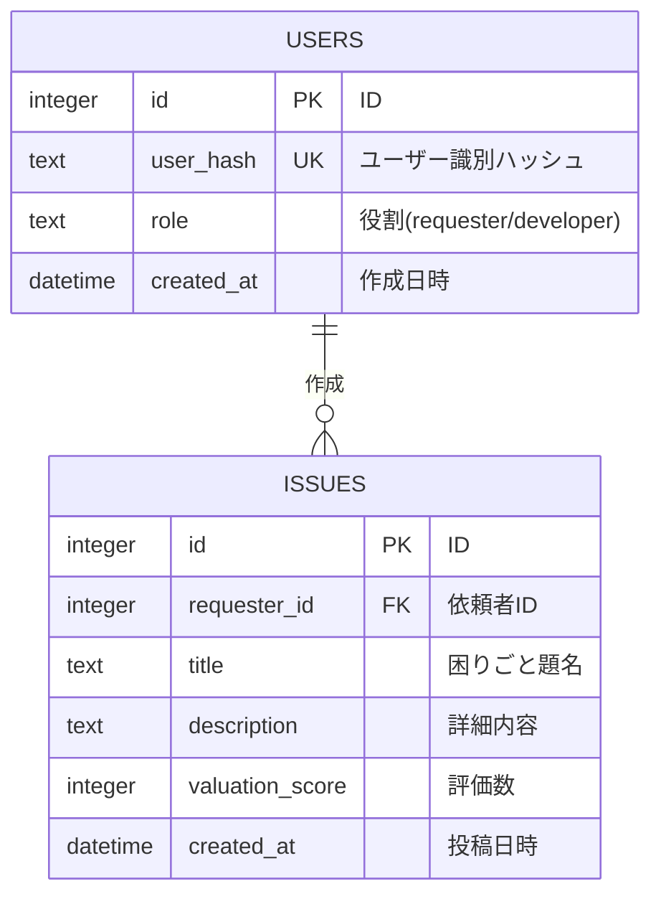

```mermaid
erDiagram
    USERS ||--o{ ISSUES : "作成"

    USERS {
        integer id PK "ID"
        text user_hash UK "ユーザー識別ハッシュ"
        text role "役割(requester/developer)"
        datetime created_at "作成日時"
    }

    ISSUES {
        integer id PK "ID"
        integer requester_id FK "依頼者ID"
        text title "困りごと題名"
        text description "詳細内容"
        integer valuation_score "評価数"
        datetime created_at "投稿日時"
    }
```
